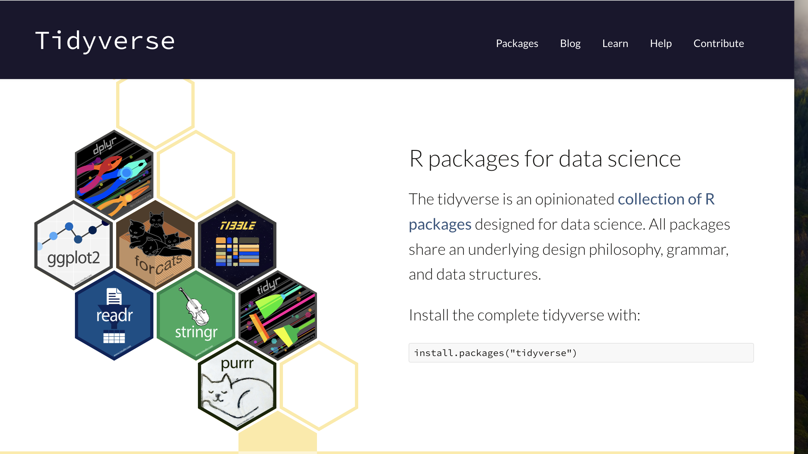

```{r setup, include=FALSE}
options(htmltools.dir.version = FALSE)
knitr::opts_chunk$set(
  fig.width=9, fig.height=3.5, fig.retina=3,
  out.width = "100%",
  cache = FALSE,
  echo = TRUE,
  message = FALSE, 
  warning = FALSE,
  hiline = TRUE
)
```

```{css, echo=FALSE}
.centered {
  display: flex;
  justify-content: center;
  align-items: center;
  height: 100vh;
}
```

```{r xaringan-themer, include=FALSE, warning=FALSE}
library(xaringanthemer)
style_mono_accent(base_color = "#23395b",text_font_size=24)
```

## Agenda
 1. Housekeeping (5 minutes)
 2. Overview of Tidyverse (3 minutes)
 3. Manipulating rows and columns with `dplyr` (20 minutes)
 4. Using ChatGPT with `dplyr` (5-10 minutes)
 5. Data Science Essentials: **Correctly interpreting means** (10-15 minutes)

---
.centered[
# Housekeeping
]
---
## Reminder to Start Zoom Recording

---
## Announcements & Reminders

-   Attendance important & cameras on please


-   Six Ways to Get Help & Course Collaboration Leaders


-   Moodle & assignments debrief


---
.centered[
# Introduction to the Tidyverse and dplyr
]

---



---
## How to install and load an R package

To install: (only need to do once)

1.    In R Studio, in lower right quadrant, click on packages tab, then "install."
2.    In R Console, use `install.packages()` function.

We can install just `dplyr` or the main Tidyverse packages by installing `tidyverse`.

To load: (need to do every time you work in your environment - put command in your script)
-   Use `library()` function.

```{r installpakcages, echo=FALSE}
# install
# install.packages("tidyverse")
# load
library(tidyverse)
```

---
## Focus on `dplyr`

`dplyr` is a Tidyverse package for efficiently manipulating datasets in R.

### Why dplyr?

- Simplified syntax
- Fast and consistent performance
- Integrates well with other Tidyverse packages

---

## Working with Tibbles

Tibbles are a modern take on data frames, optimized for the Tidyverse.

```{r tibbleDataFrame}
library(dplyr)
my_data_frame <- data.frame(x = 1:5, y = letters[1:5], z = c(TRUE,FALSE,TRUE,FALSE,TRUE))
my_tibble <- as_tibble(my_data_frame)
print(my_tibble)
```

---
## Glimpse of the tibble

```{r tibbleGlimpse}
glimpse(my_tibble)
```

---
## Basic `dplyr` Functions: Operations on ROWS

### filter()

Filters rows based on a condition.

```{r filterData}
# Filter tible to rows where x is greater than 3
filtered_data <- filter(my_tibble, x > 3)
filtered_data
```

---

### arrange()

Reorders rows.

```{r arrangeData}
# Arrange rows according to values of x in descending order
arranged_data <- arrange(my_tibble, desc(x))
arranged_data
```

---

### distinct() EXAMPLE 1

```{r distinctData1}
# create tibble with duplicates
my_tibble_dup <- as_tibble(data.frame(id=c(1,1,1,3),x=c(3,3,4,5)))
print(my_tibble_dup)

# remove rows that are duplicate ACROSS ALL COLUMNS
distinct_data <- distinct(my_tibble_dup)
distinct_data
```

---

### distinct() EXAMPLE 2

```{r distinctData}
# create tibble with duplicates
my_tibble_dup <- as_tibble(data.frame(id=c(1,1,1,3),x=c(3,3,4,5)))
print(my_tibble_dup)

# REMOVE DUPLICATES OF id, keeping first one if different values for x
distinct_id <- distinct(my_tibble_dup, id, .keep_all = TRUE)
distinct_id
```

---
### slice()

Extract specific rows.

```{r sliceData}
# get rows 1, 2 and 3
sliced_data1 <- slice(my_tibble,c(1,2,3))
sliced_data1

# get rows with 2 top maximum values of a variable
sliced_data2 <- slice_max(my_tibble,x,n=2)
sliced_data2 
```

---

## Basic `dplyr` Functions: Operations on COLUMNS

### select()

Selects columns from a dataset.

```{r selectData}
# Select columns "x" and "y"
selected_data <- select(my_tibble, x, y)
selected_data
```

---

### mutate()

Adds new columns or transforms existing ones.

```{r mutateData}
# Create a new column called "w" which is equal to "x" times 2
mutated_data <- mutate(my_tibble, w = x * 2)
mutated_data
```

---

## Combining Multiple Functions

We can chain multiple operations using the pipe operator `%>%`.

```{r combineFun}
# Revise tibble
new_data <- my_tibble %>%
  filter(z) %>%      # Filter to rows where "z" is TRUE
  select(x, y) %>%   # Select just columns "x" and "y"
  mutate(double_x = x * 2)  # Create new variable equal to "x" times 2
new_data
```

---

## Operations on GROUPS of ROWS

### summarize()

Compute summary statistics across rows for designated columns.

```{r summarizeData}
# Compute the mean of "x"
summarized_x <- summarize(my_tibble, mean_x = mean(x))

# Get the mean, median and max of "x"
summary_stats <- my_tibble %>%
  summarize(
    mean_x = mean(x),
    median_x = median(x),
    max_x = max(x)
  )
summary_stats
```

---

### group_by()

Converts a tibble into a grouped tibble where operations are performed "by group."

```{r groupData}
# Group tibble by whether "z" is true or false
grouped_data <- group_by(my_tibble, z)
grouped_data
```

---
### group_by() for other operations: EXAMPLE 1

```{r groupDataPlus1}
# Get mean of "x" for each group
grouped_data_means <- summarize(grouped_data, mean_x = mean(x))
grouped_data_means
```

---
### group_by() for other operations: EXAMPLE 2

```{r groupDataPlus2}
# Get mean, median, and max "x" for each group
grouped_summary_stats <- my_tibble %>%
    group_by(z) %>%
    summarize(
    mean_x = mean(x),
    median_x = median(x),
    max_x = max(x)
  )
grouped_summary_stats
```

---

## Operations on GROUPS of COLUMNS

### across()

Apply functions across multiple columns.

Note when you're using across() within mutate() or summarize(), `.x` represents the data from the current column being processed. It's a way to refer to each element of the column(s) you're applying the function to.

```{r acrossData}
transformed_tibble <- my_tibble %>%
  mutate(
    across(where(is.logical), as.numeric),
    across(where(is.character), ~ paste0(.x, "_modified"))
  )
transformed_tibble
```

---

## Summary

- `dplyr` provides powerful functionality for data wrangling
- Start slow and gradually add more complex combinations
- We've covered a subset of dplyr functions/verbs
- Future topics: data merging (joining)

---

## Recipes for using ChatGPT with `dplyr`

Last week, we looked at 3 use cases: (1) asking for how to do a simple task in base R; (2) explaining what a pasted line (or a few lines) of R code does; and (3) explaining an error after providing a paste of the code and returned error. 

Use cases (2) & (3) can be used for `dplyr` lines of code the same way you used it for base R. 

Today, we'll focus on strategies for building on (1) when using `dplyr`. 

---

## Recipes for using ChatGPT with `dplyr`

Basic recipe: 

-   Recipe: “**I am learning how to use `dpyr` in R. I have a data frame called [my_data_frame]. How do I ... [ENTER TASK].**"


-   The challenging part is to be **specific** and **correct** in describing the desired task.
-   As much as possible, use correct terminology to refer to your R objects (e.g. data frame, rows, columns or variables) and to the operations you want to accomplish (e.g., filter, )
-   Break down tasks into component steps. Give ChatGPT one step at a time, and gradually build.
-   It can be helpful to tell it the names of your objects (and row or column names within your data frames). 
  -   Helps you think it through.
  -   Then you can easily paste code from ChatGPT into your notebooks. 

---

## Example prompts:

“**I am learning how to use `dpyr` in R. I have a data frame called [my_data_frame]. How do I ... [ENTER TASK].**"

-   Get the rows for which the variable "age" is greater than 18.

-   Select only the columns "name" and "age"?

-   Arrange the rows by the column "test_score" in descending order? 

-   Create a new column called "pass" that is TRUE if "test_score" is greater than 70?

-   Group the data by the variable "teacher" and calculate the mean of "test_score" within each group.

---
## Check your code!

As we progress in this, class you will gain strategies for checking that your code does what you intend for it to do - whether the code was generated by ChatGPT or not. Here are some first tips: 

-   **Preview the Data:** Use head(my_data_frame) before and after applying `dplyr` functions to see if the changes look as expected. This quick check helps confirm that filtering, selecting, or mutating operations are applied correctly. DON'T PRINT ALL THE DATA! Print a subset - be strategic focusing on the rows and columns that are important - this is where using some techniques from base R can be helpful. 

-   **Verify Results with summary():** Use summary(my_data_frame) or glimpse(my_data_frame) to get a sense of your data's structure and check if new columns or changes match your expectations. This is especially useful after grouping and summarizing operations to ensure the summary statistics are correct.

-   **Cross-Check with Base R Functions:** Use base R functions like mean(), table(), or sum() to double-check the results of your dplyr operations. 

-   **Use dplyr::count(my_data_frame, variable)** to see how many observations are in each group, especially after filtering or grouping.This helps verify that the number of rows matches your expectations after an operation.

-   **Test with a Small Subset of Data:** Before applying your code to the entire data frame, try it on a smaller subset using sample_n() or a manual subset to ensure it works as intended. 

---
.centered[
# Data Science Essentials
]

---

## Data Science Essentials: Can we trust a mean? 

Mean time students in this class spent doing this past homework assignment: 1.2 hours. 

-   What does this tell you?
-   What questions do you need to ask me to understand how to interpret this? 

---

## Who's included? 

```{r DSex, echo=FALSE, eval=TRUE}
# Generating the data
set.seed(0)
hrs <- c(rnorm(18, 1.4, 0.2), 0, 0, 0)

# Calculating the mean and median
mean_hrs <- mean(hrs)
median_hrs <- median(hrs)

# Plotting the histogram
hist(hrs, breaks = 8, col = "blue", border = "black", 
     main = "Histogram of Hours with Mean and Median",
     xlab = "Hours", ylab = "Frequency")

# Adding mean and median lines
abline(v = mean_hrs, col = "red", lwd = 2, lty = 2) # Mean line
abline(v = median_hrs, col = "green", lwd = 2)      # Median line

# Adding a legend
legend("topright", legend = c(paste("Mean:", round(mean_hrs, 2)), 
                              paste("Median:", round(median_hrs, 2))),
       col = c("red", "green"), lwd = 2, lty = c(2, 1))

```

---
## Are there outliers? 

```{r DSex2, echo=FALSE, eval=TRUE}
# Generating the data
set.seed(0)
hrs <- c(rnorm(20, 1, 0.1), 5.2)

# Calculating the mean and median
mean_hrs <- mean(hrs)
median_hrs <- median(hrs)

# Plotting the histogram
hist(hrs, breaks = 8, col = "blue", border = "black", 
     main = "Histogram of Hours with Mean and Median",
     xlab = "Hours", ylab = "Frequency")

# Adding mean and median lines
abline(v = mean_hrs, col = "red", lwd = 2, lty = 2) # Mean line
abline(v = median_hrs, col = "green", lwd = 2)      # Median line

# Adding a legend
legend("topright", legend = c(paste("Mean:", round(mean_hrs, 2)), 
                              paste("Median:", round(median_hrs, 2))),
       col = c("red", "green"), lwd = 2, lty = c(2, 1))

```
---

## Comparing Means

What if I told you that students who used ChatGPT for their homework spent a mean of 1.0 hours and students who did not use ChatGPT spent a mean of 1.5 hours on the same homework? 

What questions should you ask me to interpret this? 
Do you think this could be evidence that using ChatGPT saved students time on doing the homework? 

---

## Questions to ask

To ask the analyst: 
-   How many students were in each group? (How many used ChatGPT?)
-   What is the distribution of the data in each group? 
-   Did everyone respond to the question about ChatGPT use? 

To wonder:
-   Did students answer the question about ChatGPT use honestly? 
-   How might students who decided to use ChatGPT be different from students who did not? 


